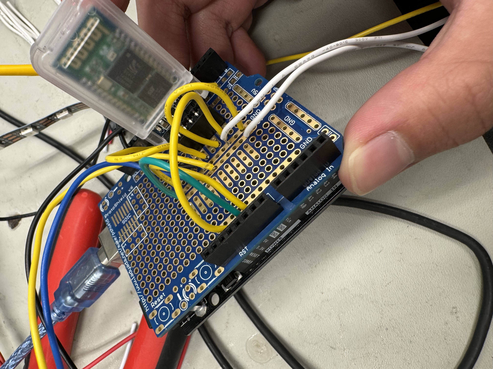
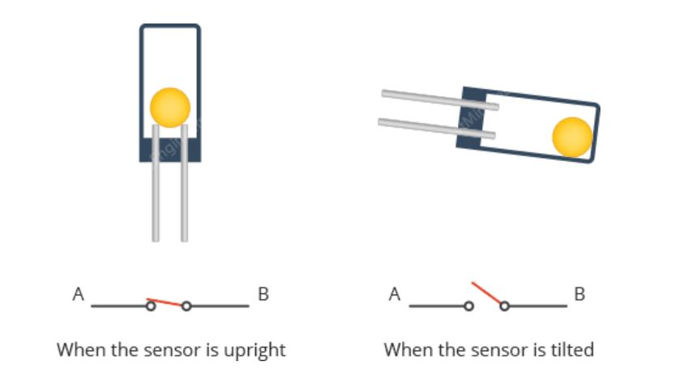

# Posture Corrector
Tired of your parents nagging you to fix your posture? Now you can have a machine to do that for you! The goal of the posture corrector is to help the user develop better posture naturally instead of a traditional back brace. This is through the use of a tilt sensor, which is able to detect tilt when the user slouches. When slouching is detected, a message is sent from an Arduino to your phone notifying you to fix your posture.
 
<!---
You should comment out all portions of your portfolio that you have not completed yet, as well as any instructions:
-->

| **Engineer** | **School** | **Area of Interest** | **Grade** |
|:--:|:--:|:--:|:--:|
| Kyle K | Prospect High School | Mechanical Engineering | Incoming Senior |

<!--- **Replace the BlueStamp logo below with an image of yourself and your completed project. Follow the guide [here](https://tomcam.github.io/least-github-pages/adding-images-github-pages-site.html) if you need help.**
-->
<!---

-->


# Demo Night
<iframe width="560" height="315" src="https://www.youtube.com/embed/xgYWWkLmvTc?si=iNB2wNLeGhQAFqF4" title="YouTube video player" frameborder="0" allow="accelerometer; autoplay; clipboard-write; encrypted-media; gyroscope; picture-in-picture; web-share" referrerpolicy="strict-origin-when-cross-origin" allowfullscreen></iframe>

# Second Modification 

<iframe width="560" height="315" src="https://www.youtube.com/embed/c_0KX9H5bLY?si=OWW0cfxlXA8gGvAx" title="YouTube video player" frameborder="0" allow="accelerometer; autoplay; clipboard-write; encrypted-media; gyroscope; picture-in-picture; web-share" referrerpolicy="strict-origin-when-cross-origin" allowfullscreen></iframe>

For my second modification, I made my posture corrector portable using a power bank along with sewing my Arduino and my LED lights to my posture corrector. 

This allows my posture corrector to be used essentially everywhere as I no longer need to have my Arduino connected to my laptop for power. To sew the Arduino and LED lights to my brace, I had to make multiple loops with my string to properly secure them in place. Sewing my Arduino, power bank, and LED lights into my back brace makes my project much easier to transport. Originally I had to carry the Arduino in my hands but now I have essentially full range of motion when moving with my back brace. 

A challenge I faced when doing the project was that I was adjusting my tilt sensor too much, causing it to break off and requiring a replacement. 

# First Modification

For my first set of modifications I have done 2 changes to my project. First I soldered my wires onto an Arduino using a protoshield.

<ins>Why add these Modifications?</ins>

 Soldering my wires onto a protoshield provides 2 great benefits for me as the protoshield both acts as a way for me to semi-permanently attach wires to my arduino, and as a breadboard. This has allowed my project to be much more compact and makes organization much easier. 
 
Most importantly, I was able to find a consistent way to determine a user’s posture by replacing my flex sensor with a tilt sensor. The flex sensor gave me a lot of issues throughout the entire process of making my posture corrector. First, it was rather difficult to implement onto my back brace as I had to tie down both ends of the sensor and it would often have trouble sticking onto the back brace.

<!--

-->


**Figure 1. The protoshield not only is a great way to make sure your wires stay connected onto the Arduino, the shield is also able to act as a breadboard saving space. The protoshield is also able to easily be taken on and off the Arduino allowing you to easily use the same Arduino for other projects.**

Second, the flex sensor would break very often, requiring me to get replacements. When I tested my posture corrector every day to try and achieve consistency, not only would it mold the plastic of the flex sensor, it would cause parts of the sensor to break off. Third, its values were very inconsistent. In the beginning, I originally used a voltage divider to have my Arduino return the resistance values of the flex sensor as voltage. However this not only made the wiring of the project very complicated, it was very inconsistent. The inconsistency made tuning my flex sensor code a massive pain. One day the values on my serial monitor would work fine, another day I would spend half an hour praying that the values don’t jump from the tens to the hundreds on a whim.

My solution was to use a tilt sensor which solved many of the flex sensor’s shortcomings. Instead of testing how the back bends, the tilt sensor instead uses the Earth’s gravity to identify if the user’s back is property straight or not. Within the tilt sensors’ metal case contains a ball, along with 2 pins at the base of the case. When the ball is at the base of the sensor an electrical current is able to flow to both pins, however if the sensor were to be tilted in which the ball falls from the base, the connection is then broken. The sensor is able to interpret this change as a high and a low. Rather than a range of values with the flex sensor, the tilt sensor only sends binary values which allows the sensor to be much more consistent. Furthermore both wiring and attatching the tilt sensor was much easier than the flex sensor. The tilt sensor is much smaller, making it easier to attach to my brace and doesn’t require a voltage divider making the wiring of the project much more simplistic.

<!--

--->


**Figure 2. As shown in the diagram, as the ball is on the base of the sensor, the pins are able to be connected as eletricity is conducted from the ball. However as gravity causes the ball to fall away from the base the connection is broken.
Image from https://lastminuteengineers.com/ball-tilt-switch-sensor-arduino-tutorial/**
 
A challenge I initially faced was stitching the tilt sensor was more difficult than I initially expected as it has some protruding parts that I had to create holes in my fabric to accommodate. Soldering my wires into the protoshield was also rather difficult as soldering is semi-permanent so I always had to double/triple check to see if I was soldering the right wires, which was very stressful for me. 

# Final Milestone

<iframe width="560" height="315" src="https://www.youtube.com/embed/NXD6nar5XYE?si=a_GLr6sXmp0tv7Gj" title="YouTube video player" frameborder="0" allow="accelerometer; autoplay; clipboard-write; encrypted-media; gyroscope; picture-in-picture; web-share" referrerpolicy="strict-origin-when-cross-origin" allowfullscreen></iframe>


For my third milestone, I added a notification extension to my MIT app that will notify the user of their poor posture as long as the Bluetooth module is connected to their device. 
The MIT app inventor allows for extensions similar to libraries that we download for our Arduino, giving us different methods/functions.

I spent much of my time understanding how my Notification extension worked. Because I spent a lot of time working on the MIT App inventor, I was able to quickly download and find the extension’s documentation. Notifications on my app can be sent through a simple “if” statement nested inside the if statement for reading the bytes from my Bluetooth Module. The block “callNotificationStyle1.HasNotificationsPermission” is used to test if the app has permission from the phone’s operating system (OS) to send notifications. If permission is allowed, I can call a notification that can go off even if the device is on other applications or in sleep mode. 

I was also able to sow my flex sensor onto my back brace to prevent the flex sensor from falling. Since it was my first time sewing, I searched how to do a simple running stitch to connect patches of fabric to my back brace that would essentially act as a pocket for my flex sensor to slip into. 

<!--

--->


**Figure 3. The orange string that lines the cloth is an example of a running stitch, a basic light stitch that allows for the fabric to stick to my back brace.**

One challenge I had with the project was finding the right notification extension. Initially, when I started working on my notifications I downloaded an extension that wasn’t very compatible with the newer versions of MIT App Inventor. This left me very confused because despite following the extension’s documentation, the app wouldn’t send out a notification. I eventually switched to a more recently updated extension, along with allowing notification permissions on my app, which resolved this issue. Another challenge I had was with sowing on my back brace. I had never seen it before, so it was hard to get started. With my shaky hands, I was unable to make very precise stitches which led to a functional, but not appealing, design. 

Many of my biggest challenges during my time at Bluestamp were the inconsistency of my hardware, my inexperience with software, and just general mistakes when soldering or wiring. There were many times when my flex sensor would either break from wear and tear or be extremely inconsistent by having its values increase over time or begin fluctuating from high to low. Unfortunately, because the flex sensor was so integral to my project, it was always a roadblock whenever I wanted to test my posture corrector. When I was working on my Arduino or the MIT app inventor I had many logic or runtime errors due to oversights in my code. There were also times when I needed replacements on materials like my Arduino and flex sensor, as I would make mistakes like shorting the Arduino when making a power line, or when burning my flex sensor when soldering. 
I think my greatest triumph was when I was able to connect my Bluetooth Module to my Android as I struggled to connect them for almost an entire week and started to become pretty discouraged. So finally getting it to work was very satisfying and motivated me to keep going. 

<!--

--->


**Figure 4. Because my flex sensor is naturally bent when the user has a straight back, to test the Bluetooth Module, I had to bend the flex sensor very often which caused the base of the flex sensor to become loose due to wear and tear. This lead to inconsistency with the flex sensor's values.**

I believe I learned a lot about both software and hardware during my time and Bluestamp. I learned techniques on soldering, what a voltage divider was, and how to properly wire Arduino.My time at Bluestamp has opened my eyes to the possible paths 
 I could take in STEM and has sparked my interest in fields like computer and electrical engineering. 

<!---
**Don't forget to replace the text below with the embedding for your milestone video. Go to Youtube, click Share -> Embed, and copy and paste the code to replace what's below.**

<iframe width="560" height="315" src="https://www.youtube.com/embed/F7M7imOVGug" title="YouTube video player" frameborder="0" allow="accelerometer; autoplay; clipboard-write; encrypted-media; gyroscope; picture-in-picture; web-share" allowfullscreen></iframe>

For your final milestone, explain the outcome of your project. Key details to include are:
- What you've accomplished since your previous milestone
- What your biggest challenges and triumphs were at BSE
- A summary of key topics you learned about
- What you hope to learn in the future after everything you've learned at BSE-->

# Second Milestone

<iframe width="560" height="315" src="https://www.youtube.com/embed/AnIjfcEkQ0s?si=EhSsgPH__iy9zQTd" title="YouTube video player" frameborder="0" allow="accelerometer; autoplay; clipboard-write; encrypted-media; gyroscope; picture-in-picture; web-share" referrerpolicy="strict-origin-when-cross-origin" allowfullscreen></iframe>


For my second milestone, I have created a Bluetooth connection with my Arduino along with a rudimentary app on my Android, which I created using MIT App Inventor. This app is able to change text on-screen to tell if the user is either slouching or not slouching based on what it receives from my Bluetooth module. 

I spent a large portion of time understanding the basics of how the Bluetooth HC-05 module works and how it's meant to be set up. Oftentimes a Bluetooth Module’s data in and data out pins are labeled transmitter and receiver. The transmitter’s job is to transmit data serially from the module to the arduino, and the receiver’s job is to receive data from the Bluetooth communication. Serial communication is the process of sending data one bit at a time, so I coded my Arduino to send one byte to the Bluetooth module, this data would then be transmitted from the module to my Android phone. 

Originally my plan was to connect the RX and TX pins of my Bluetooth to the 0 and 1 data pins on the Arduino respectively to send data. However I found quickly that this wouldn’t work. By connecting the Bluetooth’s pins to the 0 and 1 data pins of the Arduino, while it would send the bytes from the Bluetooth module, it would also send all the other data from my Arduino’s Serial Monitor, which I couldn’t use.

I was able to specifically send out the individual Bytes by creating an object using the Software Serial class from the SoftwareSerial library, where I could then specify what data pins I could connect to my Bluetooth pins to without sending data from my Serial Monitor as well. By using the .write method, I was able to print my data to the TX pin, then use the .flush method to clear the queue of bytes. 
<!--

--->


**Figure 5. On my Arduino with an object created with the Software Serial class the .write method prints data to the TX pin of the Bluetooth Module, which travels through the wires from my pin 11 onto my Bluetooth module which is transmitted to my Android.**

Now that my Arduino was able to send data to my phone, I needed to create an app to read the data and display if the user was slouching or not. For this I used MIT App Inventor. The MIT app inventor uses block-style coding which I was very unfamiliar with, so it took me a very long time to understand what I was doing. I was able to establish a Bluetooth connection with the module by creating a list picker element which, when clicked, would show the address and names of available connections.

When the Bluetooth Module is connected I had to create a system that could read the data it received. For this I used the clock component that would trigger every one-tenth of a second. From there I used a block labeled “call BluetoothClient1.ReceiveUnsigned1ByteNumber”. This block is able to read the bytes sent from my module. Because the bytes I sent were all positive numbers I would receive an unsigned byte which is always positive. With the bytes sent by my Bluetooth, I constructed a basic if state that would determine if the user is slouching based on what number it received. If the app received ‘0’ the user was not slouching if the app received ‘1’ the user is slouching. 


**Figure 6. On my MIT app inventor, the blocks here are for connecting Bluetooth and for changing the text if the user is slouching or not slouching. Listpicker1 acts as the Bluetooth picker with "setListPicker1.Elements" giving us a list of availble connections. When the Bluetooth is connected the app runs and if-if else statement in which it reads the unsigned byte recieved by the Bluetooth. Based on the number received, the text on ListPicker 2 either changes to slouching or not slouching**

I encountered multiple issues when connecting my Bluetooth module both from the module being difficult to work with, along with me not quite understanding how the Bluetooth worked. I would blindly follow guides I found online instead of trying to understand what the methods in the Software Serial library or the blocks in the MIT App inventor did. Eventually by patiently sitting down and learning what they did, I was able to make my app work. 
For my third milestone, I plan on finalizing a lot of my project. This includes soldering my wires, permanently attaching my flex sensor onto my back brace, and adding a notification system onto my app with my new understanding of what the blocks do. 

<!---
**Don't forget to replace the text below with the embedding for your milestone video. Go to Youtube, click Share -> Embed, and copy and paste the code to replace what's below.**

<iframe width="560" height="315" src="https://www.youtube.com/embed/y3VAmNlER5Y" title="YouTube video player" frameborder="0" allow="accelerometer; autoplay; clipboard-write; encrypted-media; gyroscope; picture-in-picture; web-share" allowfullscreen></iframe>

For your second milestone, explain what you've worked on since your previous milestone. You can highlight:
- Technical details of what you've accomplished and how they contribute to the final goal
- What has been surprising about the project so far
- Previous challenges you faced that you overcame
- What needs to be completed before your final milestone -->


# First Milestone

<iframe width="560" height="315" src="https://www.youtube.com/embed/TSYudepJFzY?si=NndYQ7sqB-8C4Hcd" title="YouTube video player" frameborder="0" allow="accelerometer; autoplay; clipboard-write; encrypted-media; gyroscope; picture-in-picture; web-share" referrerpolicy="strict-origin-when-cross-origin" allowfullscreen></iframe>


For my first milestone, I have a working basic prototype of my posture corrector. This is done by having a flex sensor attached to a back brace that is attached to the upper portion of the back along. There are also LED lights that will respond to the values returned by my flex sensor.


**Figure 7. A flex sensor works by having conductive ink on a small strip of plastic which acts as a variable resistor. By flexing the strip of plastic, you change the flex sensor's resistance. The more you bend the higher the resistance.
Image from https://microcontrollerslab.com/flex-sensor-arduino-tutorial/**

When you slouch, your back stretches as you bend forward. The way my device is configured is that when the user's back is in a proper position, the flex sensor will be bent. When the flex sensor is bent the conductive ink particles are farther apart increasing the resistance in the flex sensor. Likewise, when the user reclines the flex sensor is straightened as the back stretches. This will allow the conductive ink particles to be close together, allowing them to have less resistance.


**Figure 4. This diagram is the circuit schematic of the flex sensor the Analog reader reads the voltage in-between the flex sensor and the 330 Ohm resistor.**

In order to tell if the flex sensor was bent, I needed to find the resistance of the flex as the flex sensor is a variable resistor, meaning that its resistance changes based on how it bends. However the Arduino is unable to measure resistance, but it is able to measure voltage. We can find the change in voltage by using a voltage divider. The equation for the Voltage is Vout=Vin*R2R1+R2 as the two resistors are in series which means that we must add the resistance of both resistors. R1 represents the first resistor which is our 330-Ohm resistor and R2 represents our flex sensor’s resistance which may change based on how it bends. This allows for the analogRead function of my code to see the difference in voltage from the flex sensor bending as current passes through the flex sensor. From there I can return the values of the flex sensor as the sensor is straightened or bent. analogRead is able to convert the voltage from 0 to 5v into a value from 0 to 1024. Much of my time was spent testing what value the flex sensor exceeds when the user slouches. I discovered that the value hovers anywhere from 14-17. If the flex sensor has those values, the user will count as slouching in which the words "slouching" will appear on the serial monitor.


**Figure 8. Current schematic connecting the flex sensor and the LED strip**

I also have an LED strip connected to the breadboard. I was able to power both the flex sensor and the LED lights with the 5V pin of the Arduino by making a power line on the edges of the breadboard with a wire connected to one part of the power line and the 5V pin while doing the same when connecting ground. I need to code the lights to begin flashing when slouching was detected. I was able to do so with the strip.fill(A,B,C) member function. Strip is the class object created with certain member variables such as LED count and LED_PIN which allows us to control the LED strip. A dictates the color of the Neopixels, B tells where the first Neopixel should be lit up, and C tells where the last Neopixel should be lit up. Unlike a regular LED which would just turn on with a set color if it had power, the individual Neopixels are able to do different actions by being connected to a data pin on the Arduino which allows me to send data to the Neopixels and tell them which individual Neopixels should turn on and in what color. Now I need to make the lights flash instead of just showing a solid color. I was able to do this by adding delay(500); inside the if statement describing what to do if the analogRead value is too high. When the analog value is too high, the lights turn on, then the program waits 500 ms to then turn the lights off using the strip.fill function. This created a half second delay wherever the lights flash in certain intervals creating a flashing effect.

A challenging aspect of my project was with hardware, specifically soldering and wiring. When creating an extension for my flex sensor, I accidentally broke the flex sensor by keeping it in contact with the soldering iron for too long. This melted the plastic and the wiring of the flex sensor, requiring me to get a replacement. The other instance was when I accidentally shorted an Arduino UNO when making a power line for the ground wires of my Bluetooth module and LED lights. By inserting the ground wires into the power side of the breadboard, I accidentally shorted the Arduino requiring another replacement. My many errors have opened my eyes as to how much precision and care must be taken when working with physical components both for my safety and to maintain equipment quality. 

A challenging aspect of my project was with hardware, specifically soldering and wiring. When creating an extension for my flex sensor, I accidentally broke the flex sensor by keeping it in contact with the soldering iron for too long. This melted the plastic and the wiring of the flex sensor, requiring me to get a replacement. The other instance was when I accidentally shorted an Arduino UNO ;when making a power line for the ground wires of my Bluetooth module and LED lights. By inserting the ground wires into the power side of the breadboard, I accidentally shorted the Arduino requiring another replacement. My many errors have opened my eyes as to how much precision and care must be taken when working with physical components both for my safety and to maintain equipment quality.

Another challenge I faced was in the software aspect of my project, as I was quite unfamiliar with coding on an Arduino. I initially struggled with defining classes and using the various functions provided by the NEOPIXEL library. The struggle has helped me to gain a better understanding of coding on an Arduino and how to troubleshoot issues.

For my second milestone, I plan on further developing the software aspect of my project with my newfound knowledge of coding on Arduino. This is by getting a Bluetooth module to work with the Arduino. I also plan to have a basic version of my app using the MIT App Inventor.

<!---
**Don't forget to replace the text below with the embedding for your milestone video. Go to Youtube, click Share -> Embed, and copy and paste the code to replace what's below.**

<iframe width="560" height="315" src="https://www.youtube.com/embed/CaCazFBhYKs" title="YouTube video player" frameborder="0" allow="accelerometer; autoplay; clipboard-write; encrypted-media; gyroscope; picture-in-picture; web-share" allowfullscreen></iframe>

For your first milestone, describe what your project is and how you plan to build it. You can include:
- An explanation about the different components of your project and how they will all integrate together
- Technical progress you've made so far
- Challenges you're facing and solving in your future milestones
- What your plan is to complete your project --->

# Starter Project: Handheld Retro Arcade

<iframe width="560" height="315" src="https://www.youtube.com/embed/HDBI_cemtvI?si=11bn_fcc8gBkOhFm" title="YouTube video player" frameborder="0" allow="accelerometer; autoplay; clipboard-write; encrypted-media; gyroscope; picture-in-picture; web-share" referrerpolicy="strict-origin-when-cross-origin" allowfullscreen></iframe>


The Handheld Retro Arcade is mostly for soldering practice as I had to solder almost all parts of the arcade onto the main frame. This included using a soldering iron and solder to connect many of the arcade's pieces. I had to solder parts like the buttons, micro USB, IC chip, power cable, 2D LED dot matrix module, etc. along with assembling the battery case and the frame of the arcade. 

Essentially the arcade works by using either the batteries or the micro USB to power the IC Chip attached to the main frame. The IC chip acts as the brain of the arcade, containing all the code and logic for the arcade's games. With the chip powered, when the player presses any button on the arcade it sends a signal through small wires on the main frame of the arcade to the chip. When the signal reaches the IC chip, the chip can translate the input of the buttons into output by telling the 2D LED dot matrix which dots to light up. The 2D LED dot matrix is the arcade screen and how the player views the game they are playing.


**Figure 9. The IC Chip here is the brain/command center of the arcade, all actions you do in your game go through here first. Information enters and leaves the IC Chip via the pins which are the silver parts the stick out of the Chip. Each pin is unique in both position and function. When information enters the chip it is processed by layers of semiconductor wafers, copper, and other materials, which interconnect to form transistors, resistors or other components in a circuit.
Image from https://www.yourcee.online/collections/st-c**

For example, the console can translate you pressing the right button of the arcade into the action of moving the tetris piece to the right. This is by sending a signal onto the IC Chip which translates the signal into an action onto the LED Matrix. This allows the player to see that the tetris piece moves to the right.

A challenging aspect of this project is soldering the many components of the arcade console. Since I am inexperienced with soldering, soldering the smaller holes was hard to do. I also initially failed to follow instructions properly and had to restart the project in the beginning. This made me think that I was now wildly behind and I began panicking. Thankfully I was able to finish the starter project on time, and this project has taught me meaningful soldering skills and to keep my composure even in the face of hardship and difficulty. 


<!---
# Schematics 
Here's where you'll put images of your schematics. [Tinkercad](https://www.tinkercad.com/blog/official-guide-to-tinkercad-circuits) and [Fritzing](https://fritzing.org/learning/) are both great resoruces to create professional schematic diagrams, though BSE recommends Tinkercad becuase it can be done easily and for free in the browser. --->

<!---
# Code
Here's where you'll put your code. The syntax below places it into a block of code. Follow the guide [here]([url](https://www.markdownguide.org/extended-syntax/)) to learn how to customize it to your project needs. --->
# Code
```
#include <Adafruit_NeoPixel.h>                                        //Allows us to light up LED
#include <SoftwareSerial.h>                                           //Allows us to send data from the Bluetooth Module without using the Arduino's TX & RX pins

int flexpin = A0;                                                     //Where the Arduino receives flex sensor analog data
int value;
#define LED_PIN    6                                                  //pin#
#define LED_COUNT 60                                                  //# ofLEDs
Adafruit_NeoPixel strip(LED_COUNT, LED_PIN, NEO_GRB + NEO_KHZ800);    // Use constructor to make a new object from NeoPixel library
SoftwareSerial B(10,11);                                              //You define the data pins in your parameters & Create an object from Software Serial 
char Incoming_value = 0;                                              //Create variable for Incoming_value

void setup() {                                                        //begin the created objects along with the serial monitor 
  strip.begin();
  B.begin(9600);
  Serial.begin(9600);
  pinMode(13,OUTPUT);
}

void loop() {

  if(Serial.available() > 0)//Code to test if the Bluetooth Module is able to recieve signals from the Andoid phone
  {
    Incoming_value = Serial.read();
    Serial.print(Incoming_value);
    Serial.print("\n");
    if (Incoming_value == '1')
      digitalWrite(13,HIGH);
    else if(Incoming_value == '0')
      digitalWrite(13,LOW);
  }
  
  byte send = 1;
  int flexVal;
  flexVal = analogRead(flexpin);                            //Converts the Voltage into a value that is displayed on Serial Monitor
  Serial.print("Sensor: ");
  Serial.println(flexVal);
  if (flexVal >= 16){                                       //If the value exceeds a value collected by the A0 pin, the brace counts as slouching
    strip.fill(111111110000000000000000,0, 100);            //Set lights to red color
    Serial.println("Slouching");                            //prints out result in serial monitor 
    send = 1;
    B.write(send);                                          //sends byte from Bluetooth module to Ardroid phone 
    B.flush();                                              //clears input buffer
    strip.show();                                           //Lights shine
    delay(500);                                             //delay is added to create a flashing effect on the lights
    strip.fill(	0,0, 100);                                  //Sets lights to no color
    strip.show();                                           //Turns off the light
  }
  else                                                      //Code if the user is not slouching
  {
    strip.fill(	0,0, 100);                                  //Sets lights to no color
    strip.show();                                           //Turns off the light
    send = 0;
    B.write(send);
    B.flush();
  }
   
  
  delay(500);                                              //repeat loop every half a second 
}

```

<!---
# Bill of Materials

Here's where you'll list the parts in your project. To add more rows, just copy and paste the example rows below.
Don't forget to place the link of where to buy each component inside the quotation marks in the corresponding row after href =. Follow the guide [here]([url](https://www.markdownguide.org/extended-syntax/)) to learn how to customize this to your project needs. 

| **Part** | **Note** | **Price** | **Link** |
|:--:|:--:|:--:|:--:|
| Item Name | What the item is used for | $Price | <a href="https://www.amazon.com/Arduino-A000066-ARDUINO-UNO-R3/dp/B008GRTSV6/"> Link </a> |
| Item Name | What the item is used for | $Price | <a href="https://www.amazon.com/Arduino-A000066-ARDUINO-UNO-R3/dp/B008GRTSV6/"> Link </a> |
| Item Name | What the item is used for | $Price | <a href="https://www.amazon.com/Arduino-A000066-ARDUINO-UNO-R3/dp/B008GRTSV6/"> Link </a> |
--->

# Bill of Materials

| **Part** | **Note** | **Price** | **Link** |
|:--:|:--:|:--:|:--:|
| Arduino Uno | Open-source electronic device for building interactive devices | $28.50 | <a href="https://www.amazon.com/Arduino-A000066-ARDUINO-UNO-R3/dp/B008GRTSV6/"> Link </a> |
| Back Brace | Used as a template for the Flex sensor to be attatched to | $33.99 | <a href="https://www.amazon.com/TK-Care-Pro-Posture-Corrector/dp/B0BCQLYKKP"> Link </a> |
| DSD HC-05 Bluetooth Module | To send signals from the Arduino to the Android phone | $10.99 | <a href= "https://www.amazon.com/DSD-TECH-Bluetooth-iBeacon-Arduino/dp/B06WGZB2N4/ref=pd_lpo_sccl_3/138-5518948-2965568?pd_rd_w=SxQiZ&content-id=amzn1.sym.4c8c52db-06f8-4e42-8e56-912796f2ea6c&pf_rd_p=4c8c52db-06f8-4e42-8e56-912796f2ea6c&pf_rd_r=YRRKMNCJNHFM7TKKD3NQ&pd_rd_wg=ML5nv&pd_rd_r=007ef4bf-bd2e-4d68-bde2-24e1751eee4f&pd_rd_i=B06WGZB2N4&psc=1"> Link </a> |
| Flex Sensor | Returns resistance when bent | $17.95 | <a href= "https://www.sparkfun.com/products/8606"> Link </a> |
| Android | Contains the app and sends notifications | $183.99 | <a href= "https://www.amazon.com/dp/B09MZBTMQQ/ref=twister_B0BTCN5QXV?_encoding=UTF8&th=1"> Link </a> |
| LED Strip | To notify the user if they have poor posture | $19.99 | <a href= "https://www.amazon.com/LOAMLIN-WS2812B-Individually-Addressable-Waterproof/dp/B0956C7KFR/ref=sr_1_3_sspa?crid=2URKCX03WFN9Y&dib=eyJ2IjoiMSJ9.d8EXEv60wUt4xidpOjr_lEPKvRrOJ1JoRJCjfWr5fk1709lC8tG8fp1zjqItDM7EjbG0kFwVQUFJxnS9sS1YwB6qeECSK_h3v5B-JLTls0VMPYQ5naB9_uMnGgDaTE4ec5xBnCPp3xGinkNf3_cDtyndABzaBmhqu_olLZK9XYZoSGuIg-2bDVSs-IiY0SsJpo17PXKgkHaczi5TH4FVRK-jSd4YoOv4yJFMZP9OGpweZDRYujuTU7VLsxaiGzuQdM02EsIoIp07yH6P0GlyaLD6AHoF9FBX_yy6vA2ts-8.oanplGUwiTHp3nyNpj-JY1XLU2NJrYbME2rrAf8Hc5Q&dib_tag=se&keywords=adafruit%2Bled%2Bstrip&qid=1720468390&s=electronics&sprefix=adafruit%2Bled%2Bstrip%2Celectronics%2C148&sr=1-3-spons&sp_csd=d2lkZ2V0TmFtZT1zcF9hdGY&th=1"> Link </a> |
| Breadboard | Used for connectings to various devices | $5.99 | <a href= "https://www.amazon.com/Qunqi-point-Experiment-Breadboard-5-5%C3%978-2%C3%970-85cm/dp/B0135IQ0ZC/ref=sr_1_10?crid=2NREO3D61OYUY&keywords=breadboard&qid=1687992200&sprefix=breadboar%2Caps%2C210&sr=8-10"> Link </a> |
| Male/Male Jumper Wires | Used to Connect devices | $1.95 | <a href= "https://www.adafruit.com/product/1957"> Link </a> |
| Solid core wire | Used to Connect devices | $2.95 | <a href= "https://www.adafruit.com/product/2984"> Link </a> |
| 330 Ohm Resistor | Used in Voltage Divider to allow Arduino to read flex sensor values | $6.73 | <a href= "https://www.amazon.com/Projects-100EP512330R-330-Resistors-Pack/dp/B0185FID32/ref=sr_1_7?dib=eyJ2IjoiMSJ9.-yUS-QRUOwfQEjnz7IZ1kkAYHlfhi9BKLM3wuXkTiGkiFh825GyyeVPgAj4VtrHTagHZ69PCyZ4l-PKhgVaCmmU61s0_xMHiZlJ7FNYaSenDNjS556yo1gw5-cikanIZFajBn5oEVKbu4V7bpxfh8CLBU8s6MdC6gAfhkjssRhTTWwsh60QklvGCNeJfvM7y9LF-hDDuLrI8Kd0gArPFwsAJv_9bzFBOR4z-iRLBUVQ.TvtVXdbVv9umjFE7pvCkRfvqFJs8uivG1q4i10XmW-A&dib_tag=se&keywords=330+ohm+resistor&qid=1720471361&sr=8-7"> Link </a> |

**Items bought for Modifications**

| **Part** | **Note** | **Price** | **Link** |
|:--:|:--:|:--:|:--:|
| Tilt Sensor | Alternative for seeing if the user has proper posture. | $9.59 | <a href="https://www.amazon.com/uxcell-Sensor-Module-SW-520D-Arduino/dp/B07S1WN977"> Link </a> |
| Arduino Uno protoshield | Allows for a semi-permenant wiring for your Arduino | $5.49 | <a href="https://www.amazon.com/DAOKI-Prototyping-Breadboard-ATMEGA328P-ProtoShield/dp/B07XGZTMY9/ref=sr_1_4?crid=31JFD6XBHVA39&dib=eyJ2IjoiMSJ9.Tnz1H6wnpv0y71wp8rhhkLvdTUasalSWnxT6f7Pk8_vnsHgUuC1L0ob0vmjKmS4WzCdu7VZ7qTQPH1VCXFoqobcAFcWu-zKCMY6y9udj2YVWl9b8wdE1doW--qpzWEdtenIoeZp_zqLmZzVhJWdpZiQl5Qn3k7jy-1T55Y2-EL2pBqrmtVW5at23ArBr2CHSeOKo7-6Iq5ot7Hb82TNqN-1nVVYY3_nLOFKpWeNxVEevAIZnNAJVW7cuoxFou3gaeBode-_f4uy-5e8wbV7aNe8To-9eXsZehdo_r7Fxllw.QhUd4OyRV3NNoCkLb8lpehl2NeaomHoQSZKirM6U9W4&dib_tag=se&keywords=Arduino+Uno+protoshield&qid=1721159753&s=industrial&sprefix=arduino+uno+protoshiel%2Cindustrial%2C145&sr=1-4"> Link </a> |
| Power Bank | Powers the Arduino (cheaper alternative available) | $69.99 | <a href="https://www.amazon.com/Belkin-BOOSTCHARGE-Integrated-Integrated-Additional/dp/B08VH86B3G/ref=sr_1_2?dib=eyJ2IjoiMSJ9.j4XQl0n5MxWVWHfu1-PK99Rt3K4KhHe-oArxhnke03nmaDGtWSvERmrOPGNY5dwHmkdKUAZ9YiB8HkSSYKDutiajPy-yYhUUmG5op1w7Py-cMGidhU2r4-hB_xzcRjT-N10pz6goEueaRcTFsblYRkvt3_YD9BeudOTcX0-4t6lH_B9t_SBavslzWEJtlGDKvpB4osmi39YYyrhu6J_rhtT61VbM6AtgujGs-OI-tuo.SJKwxFQbperbn3YE7HIjbcOOJ7q6sgnG3HK5CbeUxqg&dib_tag=se&hvadid=642480020396&hvdev=c&hvlocphy=9032183&hvnetw=g&hvqmt=e&hvrand=10664272944528762051&hvtargid=kwd-1437992897244&hydadcr=954_1014973519&keywords=belkin+boost+charge+plus+10k&qid=1721160767&sr=8-2"> Link </a> |

# Other Resources/Examples
- [AnalogRead of Flexsensor](https://www.youtube.com/watch?v=8BNp6niBp-A) 
- [Install LED strip onto Arduino](https://www.learnelectronicsindia.com/post/interfacing-neopixel-strip-with-arduino-tinkercad)
- [Set up Bluetooth Module](https://www.youtube.com/watch?si=HPFs6htX0e5Mx7zb&v=aQcJ4uHdQEA&feature=youtu.be)
- [To send Bytes through Arduino using Bluetooth Module](https://forum.arduino.cc/t/sending-and-receiving-bytes-through-bluetooth/925524/3)
- [Notification Setup for MIT app inventor](https://community.appinventor.mit.edu/t/free-notification-style-extension-with-various-types-of-notification/12115)
- [How to do a Running Stitch](https://penguinandfish.com/blogs/embroidery-stitches/how-to-do-a-running-stitch)
<!---
To watch the BSE tutorial on how to create a portfolio, click here.
--->
